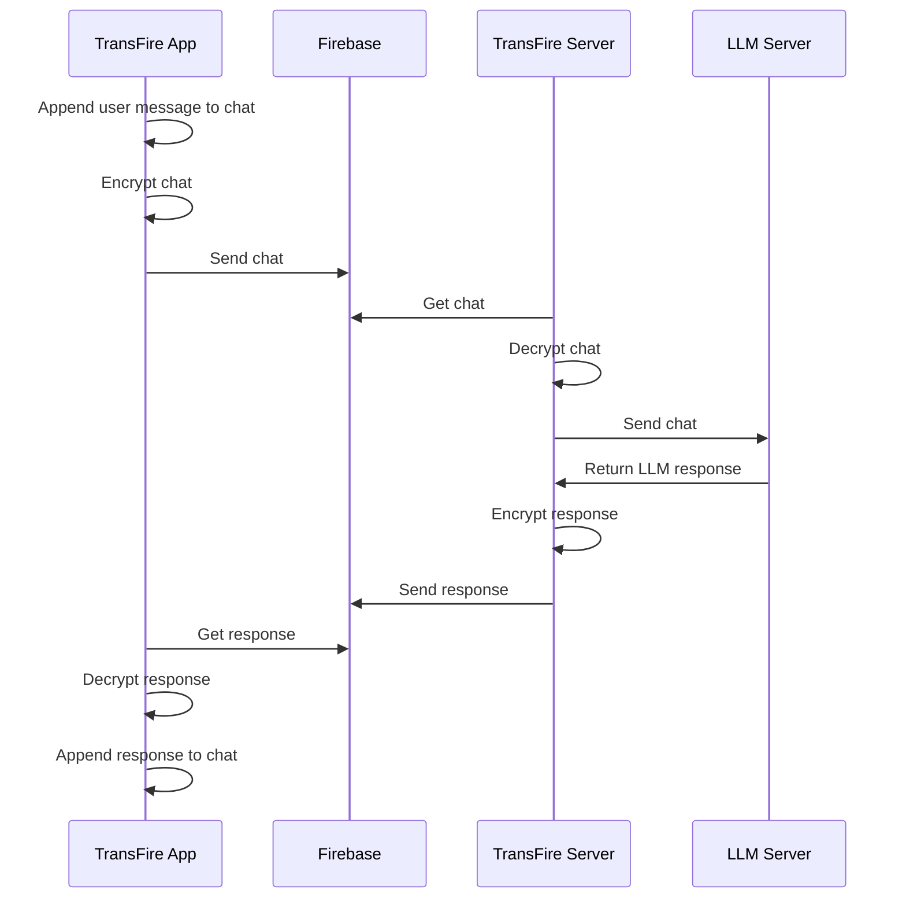

# 🔥 TransFire

TransFire is a simple tool that allows you to use your locally running LLMs while far from home, whitout requiring port forwarding. TransFire will route an OpenAI compatible API exposed by LMStudio or Ollama through your firebase instance of choice, encrypting all traffic with a pre-shared AES key so not even Google will be able to read your conversations.

## 🔨 Setup

First you will need to setup the client:

1. Install the APK on your phone
2. Go to the [Firebase console](https://console.firebase.google.com/).
3. Click on `Create a new Firebase project`
4. Proceed through the whole process, opting out of Analytics and Gemini preferably
5. Now on the left panel, expand the `Build` dropdown and select `Realtime Database`
6. Click on `Create Database`
7. Select a database region of your choice
8. Select `Start in locked mode` and proceed
9. Click on the URL icon to copy the database URL. This is your **Firebase Database URL**
10. Now clck on the settings icon in the top-left corner and open `Project Settings`
11. Go to the `Service accounts` tab and then click on `Database secrets`
12. You should see one secret in the list, if not click on `Add secret`
13. Hover on the secret to reveal the `Show` button and click it, then copy the key. This is your **Firebase Database API key**
14. Now go to the app and click on `Get started`
15. Put the `Firebase Database URL` and `Firebase Database API key` in the corresponding fields, then choose an AES password to encrypt the traffic to/from Firebase and put it into `Encryption password`.
16. Click on `Save configuration` and then `Next`.
17. You can now proceed to server configuration

Now you can setup and start the server:

1. Open the terminal in the `transfire-server/` directory
2. Create a virtual environment with `python3 -m venv .venv`
3. Activate it with `source .venv/bin/activate`
4. Install dependencies with `pip3 install -r requirements.txt`
5. Now copy `example.env` to `.env`
6. Open the new `.env` file
7. Fill in the fields `FIREBASE_URL`, `FIREBASE_API_KEY`, `ENCRYPTION_PASSWORD` with the same values used in the client setup
8. Choose a `POLL_INTERVAL`, not too low (<3) or you risk to finish your free firebase daily usage
9. Put the correct `OPENAI_LIKE_API_URL`. It will be `http://127.0.0.1:1234` if you are using LMStudio or `http://127.0.0.1:11434` if you are using Ollama
10. `OPENAI_LIKE_API_KEY` should stay as is, change it only if you know what you are doing (for example using remote APIs)
11. Start the server with `python3 server.py`

## 🔩 How it works

