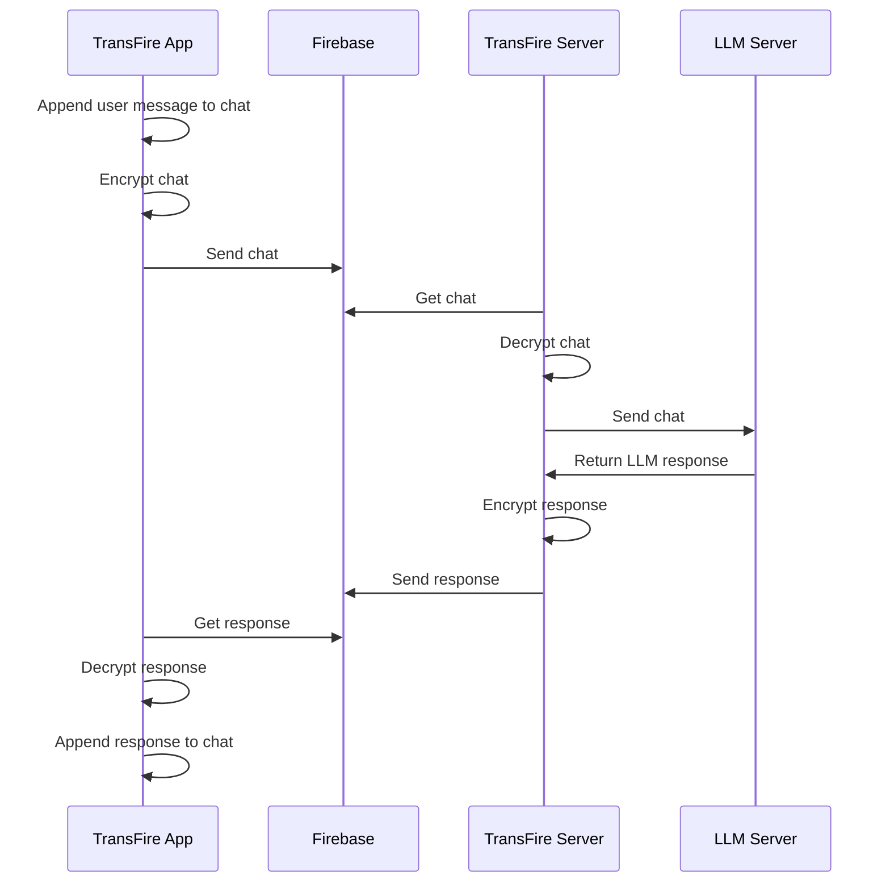

# 🔥 TransFire

TransFire is a simple tool that allows you to use your locally running LLMs while far from home, without requiring port forwarding. TransFire will route an OpenAI compatible API exposed by LMStudio or Ollama through your firebase instance of choice, encrypting all traffic with a pre-shared AES key so not even Google will be able to read your conversations.

To get started [download and install the apk](https://github.com/Belluxx/TransFire/releases/download/v1.0/transfire-v1.0.apk) and follow the setup instructions below.

> [!NOTE]  
> If you want to access LLMs remotely, Tailscale is a much better solution than this one. I built this fir two main reasons:
> - For fun
> - For experimenting with an uncommon use of Firebase RTDB

## 📱 Screnshots

  
  
  

## 🔨 Setup

First you will need to setup the client:

1. Install the APK on your phone
2. Go to the [Firebase console](https://console.firebase.google.com/).
3. Click on `Create a new Firebase project`
4. Proceed through the whole process, opting out of Analytics and Gemini preferably
5. Now on the left panel, expand the `Build` dropdown and select `Realtime Database`
6. Click on `Create Database`
7. Select a database region of your choice
8. Select `Start in locked mode` and proceed
9. Click on the URL icon to copy the database URL. This is your **Firebase Database URL**
10. Now click on the settings icon in the top-left corner and open `Project Settings`
11. Go to the `Service accounts` tab and then click on `Database secrets`
12. You should see one secret in the list, if not click on `Add secret`
13. Hover on the secret to reveal the `Show` button and click it, then copy the key. This is your **Firebase Database API key**
14. Now go to the app and click on `Get started`
15. Put the `Firebase Database URL` and `Firebase Database API key` in the corresponding fields, then choose an AES password to encrypt the traffic to/from Firebase and put it into `Encryption password`.
16. Click on `Save configuration` and then `Next`.
17. You can now proceed to server configuration

Now you can setup and start the server:

1. Clone the repository with `git clone https://github.com/Belluxx/TransFire`
2. Navigate to the server directory with `cd TransFire/transfire-server/`
3. Create a virtual environment with `python3 -m venv .venv`
4. Activate it with `source .venv/bin/activate`
5. Install dependencies with `pip3 install -r requirements.txt`
6. Now copy `example.env` to `.env`
7. Open the new `.env` file
8. Fill in the fields `FIREBASE_URL`, `FIREBASE_API_KEY`, `ENCRYPTION_PASSWORD` with the same values used during the client setup
9. Choose a `POLL_INTERVAL`, not too low (use >2 seconds) or you risk finishing your free firebase daily usage
10. Put the correct `OPENAI_LIKE_API_URL`. It will be `http://127.0.0.1:1234` if you are using LMStudio or `http://127.0.0.1:11434` if you are using Ollama
11. `OPENAI_LIKE_API_KEY` should stay as is, change it only if you know what you are doing (for example using remote APIs)
12. Start the server with `python3 server.py`

## 🔩 How it works

## ⚠️ Limitations

- No support for two simultaneous clients using the same Firebase Database
- No automatic detection of available models due to the heterogeneity of Ollama, LMStudio, etc...
- No support for chat history and multiple chats (will be added in the future)

## Credits

Thanks to [compose-richtext](https://github.com/halilozercan/compose-richtext) I was able to add markdown parsing that is essential to make LLM output readable.
